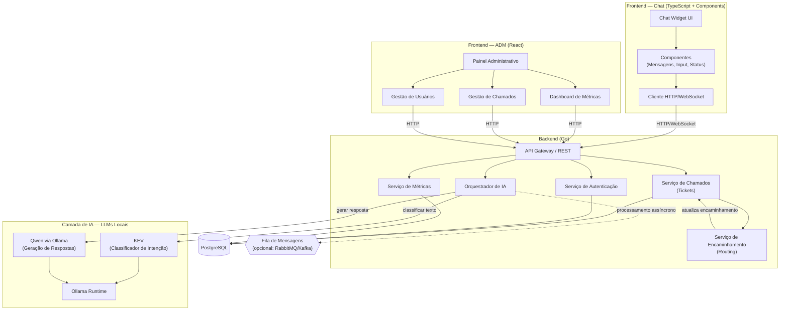

# Arquitetura de Software — HelpBot

Arquitetura proposta com backend em Go, frontend de chat em TypeScript, painel administrativo em React e LLMs locais executadas pelo Ollama.

O arquivo fonte PlantUML correspondente está em [`arquitetura.puml`](./arquitetura.puml).
