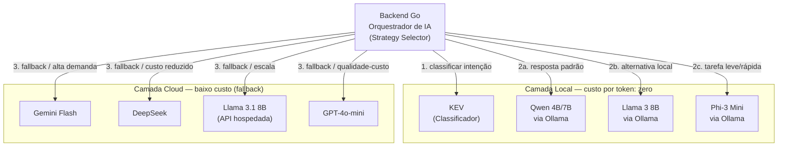

# Arquitetura de LLMs de Baixo Custo

Arquitetura alternativa com modelos locais como primeira opção e APIs econômicas como fallback.

> Os modelos locais não cobram por token, mas exigem infraestrutura própria. Os custos das APIs podem variar conforme o provedor, modelo e data de consulta.

## Estratégia sugerida

1. Usar o **KEV** para classificar a intenção e a complexidade do chamado.
2. Encaminhar solicitações simples para o **Qwen local via Ollama**.
3. Utilizar **Phi** ou **Llama** localmente quando houver necessidade de menor consumo ou modelo alternativo.
4. Acionar uma API de fallback somente quando o modelo local estiver indisponível, sobrecarregado ou apresentar baixa confiança.
5. Registrar modelo utilizado, latência, custo estimado e taxa de encaminhamento para monitoramento.

O arquivo fonte PlantUML correspondente está em [`arquitetura_llms_baratas.puml`](./arquitetura_llms_baratas.puml).
