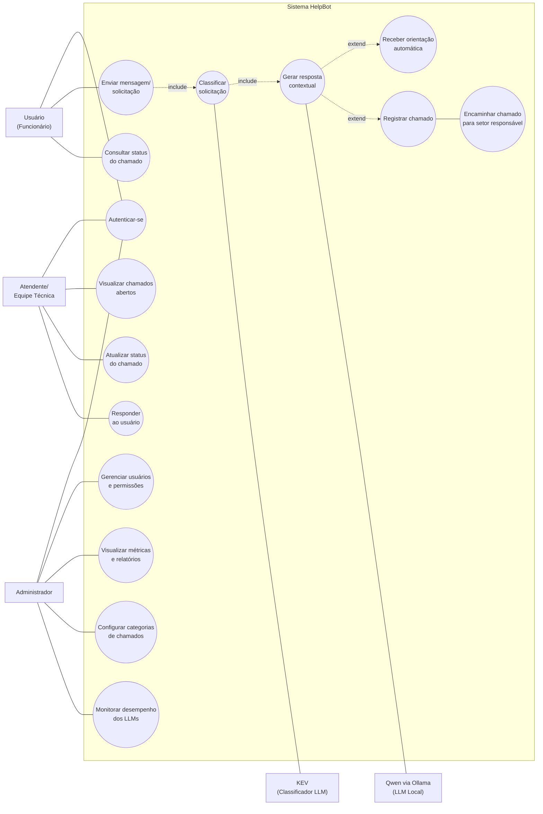

# Diagrama UML — Casos de Uso

Este diagrama representa os principais casos de uso do sistema HelpBot.

```mermaid
flowchart LR
    Usuario["Usuário<br/>(Funcionário)"]
    Atendente["Atendente/<br/>Equipe Técnica"]
    Admin["Administrador"]
    KEV["KEV<br/>(Classificador LLM)"]
    Qwen["Qwen via Ollama<br/>(LLM Local)"]

    subgraph Sistema["Sistema HelpBot"]
        UC15((Autenticar-se))
        UC1((Enviar mensagem/<br/>solicitação))
        UC2((Consultar status<br/>do chamado))
        UC3((Receber orientação<br/>automática))
        UC4((Classificar<br/>solicitação))
        UC5((Gerar resposta<br/>contextual))
        UC6((Registrar chamado))
        UC7((Encaminhar chamado<br/>para setor responsável))
        UC8((Visualizar chamados<br/>abertos))
        UC9((Atualizar status<br/>do chamado))
        UC10((Responder<br/>ao usuário))
        UC11((Gerenciar usuários<br/>e permissões))
        UC12((Visualizar métricas<br/>e relatórios))
        UC13((Configurar categorias<br/>de chamados))
        UC14((Monitorar desempenho<br/>dos LLMs))
    end

    Usuario --- UC15
    Usuario --- UC1
    Usuario --- UC2
    UC1 -.->|include| UC4
    UC4 -.->|include| UC5
    UC5 -.->|extend| UC3
    UC5 -.->|extend| UC6
    UC6 --- UC7
    UC4 --- KEV
    UC5 --- Qwen

    Atendente --- UC15
    Atendente --- UC8
    Atendente --- UC9
    Atendente --- UC10

    Admin --- UC15
    Admin --- UC11
    Admin --- UC12
    Admin --- UC13
    Admin --- UC14
```

O arquivo fonte PlantUML correspondente está em [`usecase.puml`](./usecase.puml).
